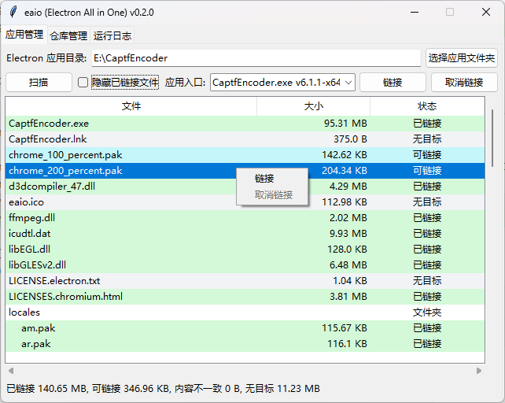
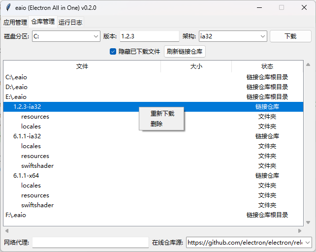

# eaio (Electron All in One)

一个通过将磁盘上所有[Electron](https://github.com/electron/electron)应用中相同文件硬链接到统一位置来减少磁盘占用的解决方案，就像`pnpm`一样。

## 使用介绍

### [简体中文](docs/guide/zh-Hans.md)

## 原理

硬链接会将多个文件指向同一磁盘位置，使得多个相同的文件只占用一份空间。

## Q&A

1. Q: 为什么不用更优雅的软链接？

   A: 软链接状态下的`electron.exe`无法正确判断运行目录(如有解决方法欢迎讨论)，且可能因为一些原因造成误删。
2. Q: 为什么不用`electron`命令行指定`resources`路径？

   A: 一些应用会在运行目录下放置额外的`.exe`或`.dll`文件，指定应用路径可能会造成应用无法找到这些文件。
3. Q: 只支持 Windows 吗？

   A: 其他系统暂未测试有效性，如本方案可用于其它系统，后续会支持。

## 注意事项

1. 本工具会在执行`link`或`check`操作时，在目标应用所在的磁盘分区下创建`.eaio`仓库，用于存储硬链接的源文件，如无特殊情况请**不要删、改**。
2. 本工具的`status`操作可以检查所有磁盘分区下`.eaio`仓库中所有版本的完整性和有效性，可用于检查**下载完成**情况、源文件**存在**情况、源文件**改动**情况。
3. 本工具的`download`操作可以下载目标版本和架构的`Electron`预编译程序到指定磁盘分区的`.eaio`仓库中，如果已存在则会进行**覆盖**，所以也可用于对源文件的**恢复/修复**。
4. 请不要对已链接的`Electron`应用进行**文件粉碎**操作，可能会导致源文件改动。
5. 请不要对`.eaio`仓库进行**文件粉碎**操作，可能会导致已链接的`Electron`应用文件改动。

## 参与开发

1. 拉取本仓库的代码
2. 本项目使用[pdm](https://github.com/pdm-project/pdm)作为包管理工具，确保你已安装`pdm`并配置好其环境
3. 执行`pdm sync`以安装依赖到虚拟环境
4. 修改代码
5. 推送修改并提交pr

## todo

- [ ] 全盘扫描 Electron 应用
- [ ] 验证其他系统有效性

## 趋势

