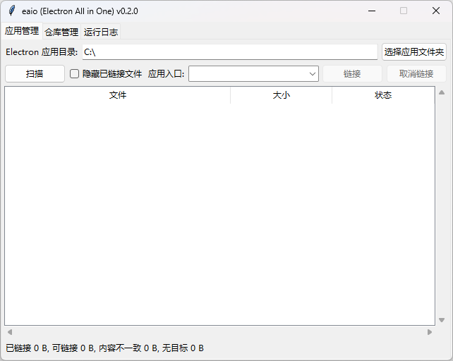
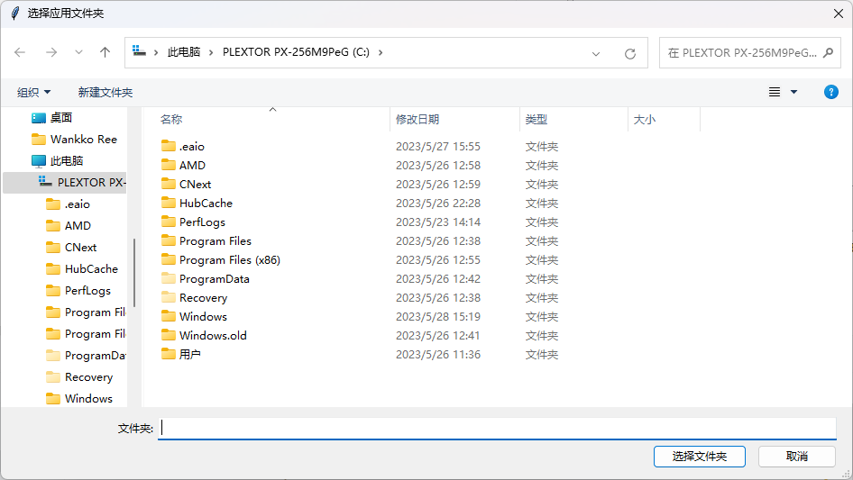
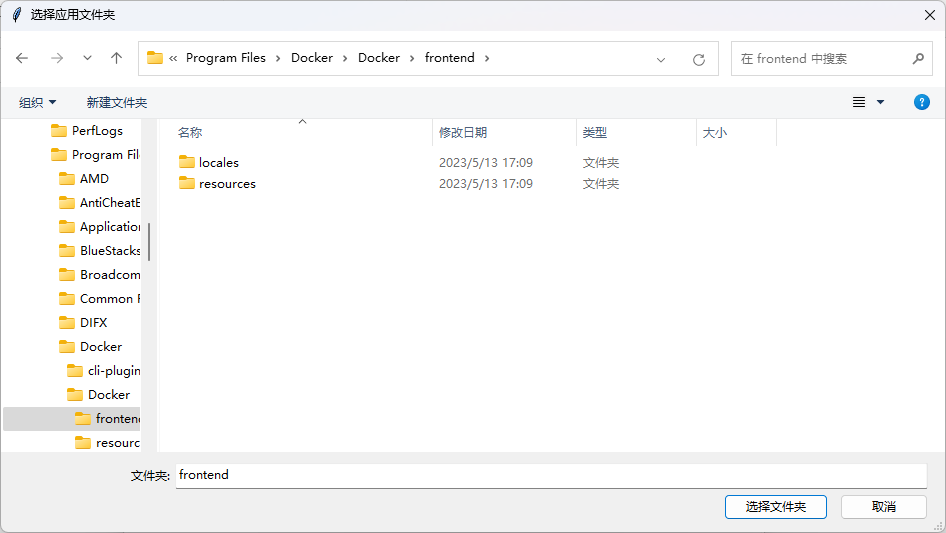
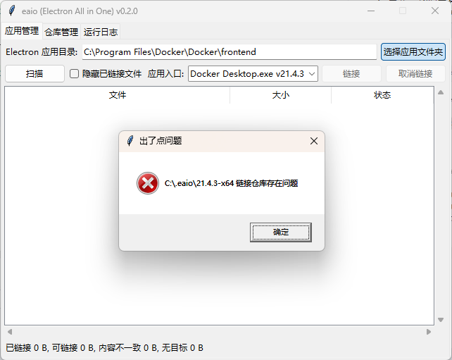
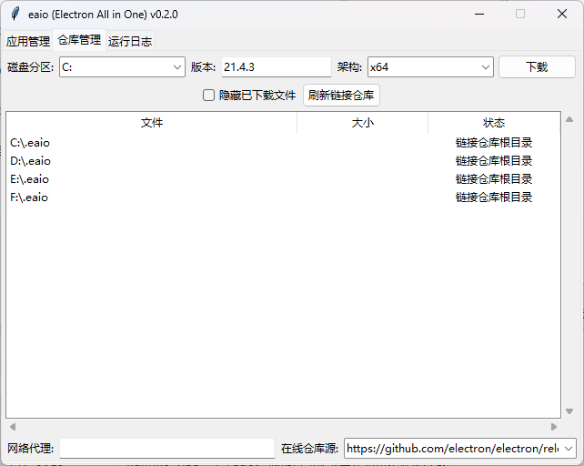
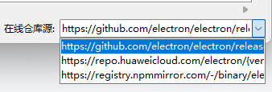
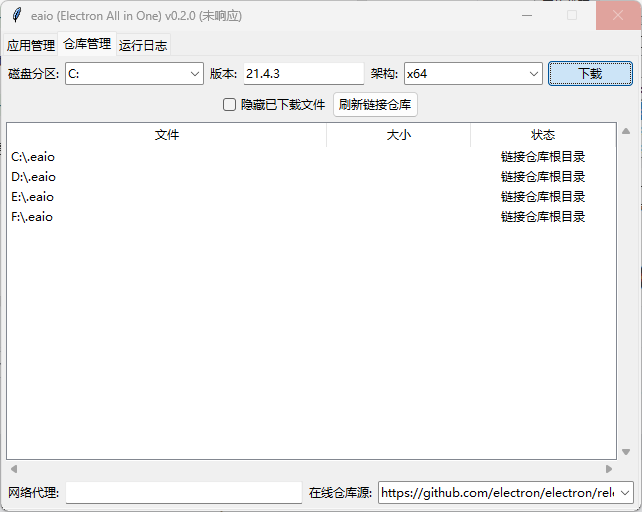
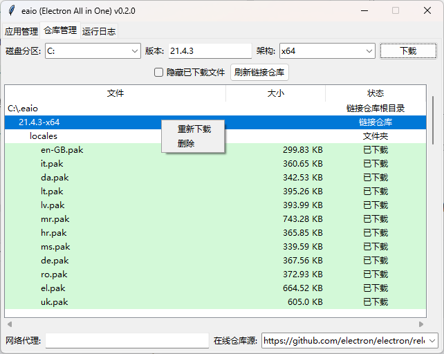
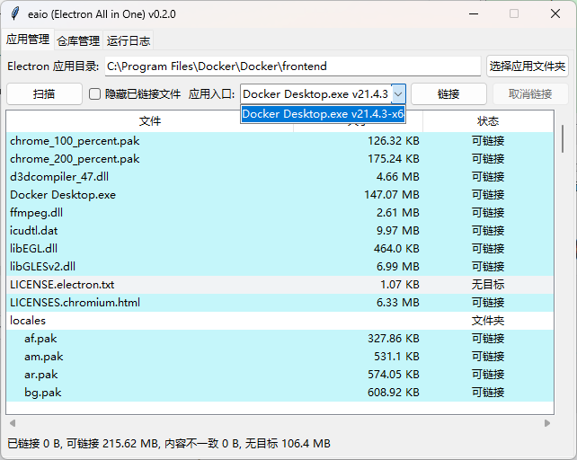
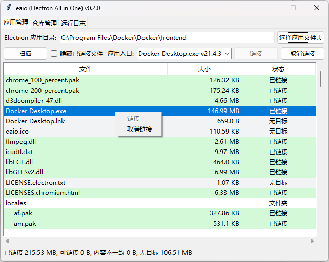

## 用户界面 (GUI)

### 链接

1. 我们打开工具后，可以看到类似下图的**应用管理**界面。

   

2. 首先，我们需要选择希望链接的目标 Electron 应用(下简称"目标应用")所在的文件夹，所以，*点击**选择应用文件夹***，我们可以看到类似下图的选择界面。

   

3. 找到应用所在的文件夹，此处以`Docker Desktop for Windows`为例。

   

4. 如果目标应用使用的 Electron 版本(下简称"目标版本")为第一次在目标应用所在的磁盘分区中被链接，则可能显示如下提示，如未出现提示则前往第 9 步，如**应用入口**有误请点击**确认**后重新选择正确的**应用入口**。

   

5. 点击提示中的**确认**后，将自动跳转至**仓库管理**界面，并会自动选择对应的**磁盘分区**、**版本**、**架构**。

   

6. 请确认网络环境可以正常访问 GitHub 服务，如网络存在问题请切换**在线仓库源**为国内源，或修改**网络代理**。

   

7. 点击**下载**并等待一段时间，通常需要十几秒钟，具体视网速决定，期间窗口可能会发生卡死或无响应，请耐心等待直至窗口恢复响应。

   

8. 下载完成后会自动刷新显示的链接仓库，如未刷新可手动点击**刷新连接仓库**，右键**链接仓库**可进行**重新下载**或**删除**。

   

9. 回到**应用管理**界面，再次确认**应用入口**正确无误。

   

10. 点击**链接**按钮开始链接，链接完成后可以看到类似下图的显示效果，右键文件可单独进行**链接**或**取消链接**。

   

## 目标应用发生更新后的操作

> 待编写

## 命令行 (CLI)

## 链接

> 待编写

## 目标应用发生更新后的操作

> 待编写
